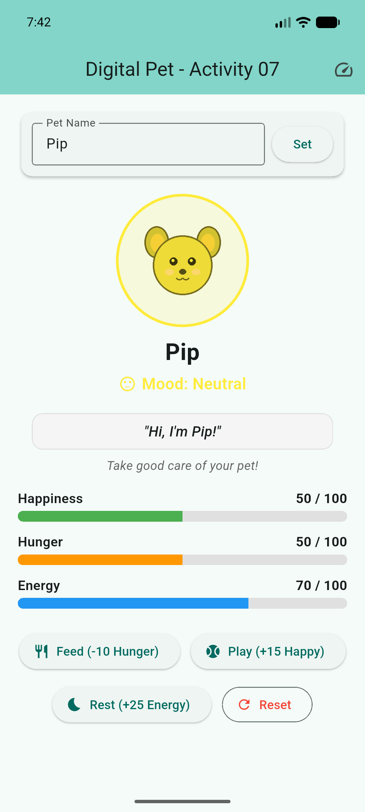
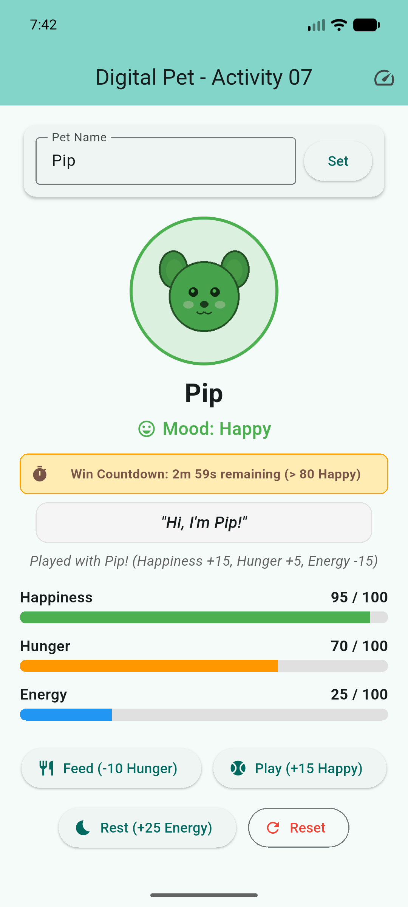
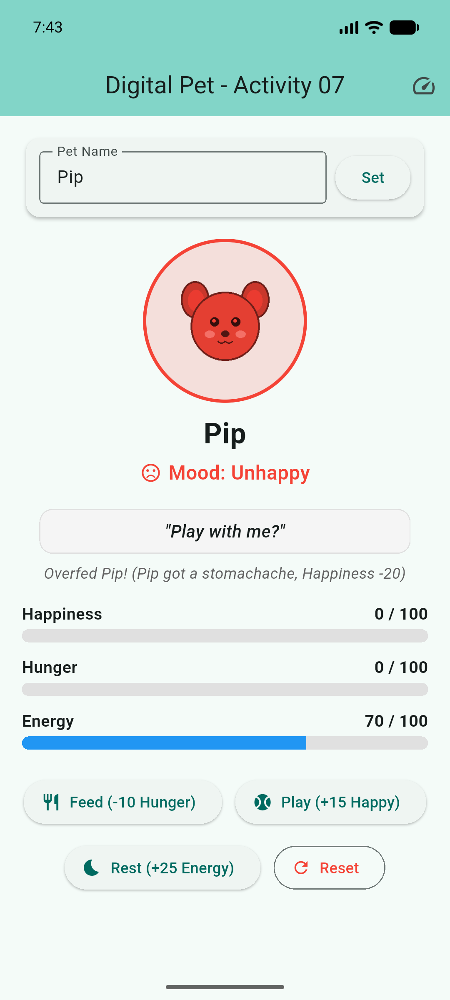

# In-Class Activity 07: Digital Pet State Lab

Collaborative Flutter state-management simulation app built with `StatefulWidget`, `setState()`, lifecycle-aware timers, and accessible feedback.

## Team Workstreams & Collaborators
- **Pathway**: Undergraduate Pathway
- **Team 1 (Care Systems & Core State)**:
  - **Member**: Adi Tauqir ([@aditauqir](https://github.com/aditauqir))
  - **Responsibilities**: Care loop, bounded state meters (0-100), timer lifecycles (30-second hunger, 3-minute continuous win), energy system, outcome rules, state boundary tests.
  - **Pull Request**: [#1: Care Systems & Logic](https://github.com/aditauqir/In-Class-Activity-07-Digital-Pet/pull/1)
- **Team 2 (Pet Personality & Visual Polish)**:
  - **Member**: [Wilder Edwards](https://github.com/WilderEdwards) ([@WilderEdwards](https://github.com/WilderEdwards))
  - **Responsibilities**: Transparent pet PNG asset, `ColorFiltered` mood tinting, visual polish bundle (`AnimatedScale` bounce, `AnimatedSwitcher`, `TweenAnimationBuilder` living meters, action reactions), reduced-motion support.
  - **Pull Request**: [#2: Pet Personality & UI](https://github.com/aditauqir/In-Class-Activity-07-Digital-Pet/pull/2)

---

## App Screenshots

| Neutral Mood (Initial State) | Happy Mood (> 80 with Win Timer) | Unhappy Mood (< 30 Overfed State) |
| :---: | :---: | :---: |
|  |  |  |

---

## Implemented Features (Undergraduate Scope)

### Core Care Systems (Team 1)
- **Pet Name**: Configurable pet name with an input field and confirmed display; `TextEditingController` cleanly released in `dispose()`.
- **Bounded State Meters (0-100)**:
  - **Happiness** (starts at 50, clamped strictly between 0 and 100).
  - **Hunger** (starts at 50, clamped strictly between 0 and 100).
- **Core Actions**:
  - **Feed**: Decreases hunger by 10. If resulting hunger is $< 30$ (overfeeding), happiness decreases by 20; otherwise happiness increases by 10.
  - **Play**: Increases happiness by 15, increases hunger by 5, and drains 15 energy.
  - **Reset**: Restores meters to default (50/50/70), cancels active win timers, resets game outcomes, and starts a fresh hunger timer.
- **Timer Lifecycle Management**:
  - **30-Second Periodic Hunger Timer**: Started in `initState()` and canceled in `dispose()` and on game over/win.
  - **Overflow Penalty Rule**: A tick reaching 100 does not penalize happiness; subsequent ticks while at 100 reduce happiness by 20.
  - **3-Minute Win Timer**: Continuous happiness $> 80$ starts a 3-minute win timer. If happiness drops to $\le 80$, the win timer is canceled and cleared.
  - **Loss Condition**: Triggered when Hunger reaches 100 AND Happiness drops to $\le 10$. All care controls are disabled until Reset.
- **Fast Test Timer Toggle**:
  - App bar action toggle allows switching between **Production Timers** (30s hunger, 3-minute win) and **Fast Test Timers** (5s hunger, 10s win) for rapid evaluation and grading.

### Advanced Feature 1: Energy System (Team 1)
- **Energy Meter (0-100)**: Starts at 70.
- **Costs**: Playing costs 15 energy. If energy drops below 15, pet is exhausted and cannot play until rested.
- **Recovery**: Rest / Nap action restores +25 energy (and slightly increases hunger by +5).

### Advanced Feature 2: Visual Polish & Accessible Motion (Team 2)
- **Transparent Asset Tinting**: Uses `ColorFiltered` with `BlendMode.modulate` on `assets/pet.png`:
  - Green when happiness $> 70$.
  - Yellow when happiness is between 30 and 70.
  - Red when happiness $< 30$.
- **Accessible Presentation**: Accompanied by text labels and mood icons so color is never the sole indicator.
- **Action Bounce & Scale**: Wraps the pet in `AnimatedScale` with responsive scaling on actions and mood bands.
- **Living Meters**: Employs `TweenAnimationBuilder<double>` for smooth meter transitions.
- **Speech Bubble & Expression Crossfade**: Uses `AnimatedSwitcher` to crossfade derived pet messages.
- **Reduced Motion Support**: Honors `MediaQuery.of(context).disableAnimations` to disable non-essential motion.

---

## Feature to Learning Outcome Map

| Feature | Learning Outcome | Implementation & Evidence |
| :--- | :--- | :--- |
| **Animated bounce** | UI responds to state; delayed callbacks respect widget lifecycle | `AnimatedScale` scales pet to 1.15 on action taps; timers check `mounted` before ending bounce. |
| **Mood tint and size** | Color and scale derive from happiness using the defined mood thresholds | Coat color, label, icon, and scale change at thresholds 29, 30, 70, and 71. |
| **Living meters** | Build reads state-derived values without side effects | `TweenAnimationBuilder<double>` glides meter bars smoothly without mutating underlying state. |
| **Reduced-motion support** | Interaction remains usable with motion disabled | `MediaQuery.of(context).disableAnimations` sets animation durations to `Duration.zero`. |
| **Energy system** | Bounded multi-variable game loop logic | Bounded meter (0-100) gating play actions when energy $< 15$ and recovered via rest actions. |

---

## Mood Threshold Evidence (29, 30, 70, 71)

| Happiness Value | Mood Label | Coat Tint Color | Pet Scale | Mood Icon | Reduced-Motion Behavior |
| :---: | :---: | :---: | :---: | :---: | :---: |
| **29** | Unhappy | Red (`Colors.red`) | 0.94 | `sentiment_very_dissatisfied` | Instant color/label update, scale animation skipped |
| **30** | Neutral | Yellow (`Colors.yellow`) | 1.00 | `sentiment_neutral` | Instant color/label update, scale animation skipped |
| **70** | Neutral | Yellow (`Colors.yellow`) | 1.00 | `sentiment_neutral` | Instant color/label update, scale animation skipped |
| **71** | Happy | Green (`Colors.green`) | 1.06 | `sentiment_very_satisfied` | Instant color/label update, scale animation skipped |

---

## Minimum Manual Test Matrix

| Scenario | Expected Result | Verified Result |
| :--- | :--- | :--- |
| **Feed at hunger 5; feed at hunger 95** | Hunger remains in 0-100; happiness rule is applied using resulting hunger. | Hunger clamps at 0; overfeeding penalty (-20 happiness) applies when hunger $< 30$. |
| **Play at happiness 95; play at energy 5** | Meters stay in 0-100; energy restriction blocks play when energy $< 15$. | Happiness clamps at 100; pet reports exhaustion and prompts user to rest. |
| **Happiness stays above 80 for 2:59, then drops to 80** | No win; pending win timer is canceled and cleared. | Win countdown disappears; win timer is canceled and set to null. |
| **Happiness stays above 80 continuously for 3:00** | Win at three continuous minutes; hunger timer stops. | Victory banner displays; hunger timer cancels cleanly. |
| **Hunger moves from 95 to 100, then receives another tick** | First tick reaches 100 with no penalty; subsequent overflow tick reduces happiness by 20. | Hunger clamps at 100; next tick at 100 subtracts 20 happiness. |
| **Hunger reaches 100 and happiness reaches 10** | Game over appears; care actions disabled until restart. | Game over banner displays; all action buttons disabled except Reset. |
| **Leave the pet screen while timer is active** | Timers canceled in `dispose()`; no post-dispose updates. | Clean disposal; 0 lifecycle console errors or exceptions. |

---

## Setup & Running the App

```bash
# Get dependencies
flutter pub get

# Run static analysis
flutter analyze

# Run automated tests
flutter test

# Run app on connected device or emulator
flutter run

# Build release APK
flutter build apk --release
```

---

## Automated Test Evidence

Both test suites pass with zero warnings:
1. `test/widget_test.dart`: Verifies initial rendering, feed action, play action, and reset.
2. `test/state_boundary_test.dart`:
   - Clamping meters at lower (0) and upper (100) bounds.
   - Energy exhaustion restrictions on play.
   - Win condition timer initiation strictly above 80 (and not at 80).
   - Reset behavior cancelling win timer and restoring defaults.

---

## Asset Attribution & License

- **`assets/pet.png`**: Original light-gray transparent illustration created for Activity 07 Digital Pet State Lab. Designed specifically with a transparent alpha channel for compatibility with `BlendMode.modulate` color tinting. Licensed under the MIT License for educational use.
